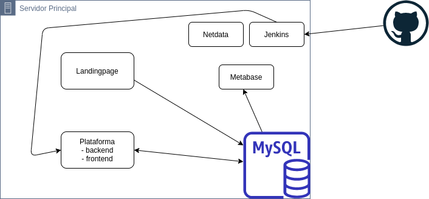

## Arquitectura Actual

::: warning Nota
La arquitectura mostrada en el gráfico de arriba representa 
lo que tenemos actualmente en el ambiente de desarrollo.
:::

## Arquitectura para PRODUCCIÓN

::: warning Nota
Hablar con el equipo y decidir
:::

::: tip SERVICIOS
- El objetivo es desglosar al máximo los servicios que brinde la plataforma.
Los mismos deben decidirse en base a la proyección de uso de la plataforma teniendo en cuenta la escalabilidad de los servicios más usados.