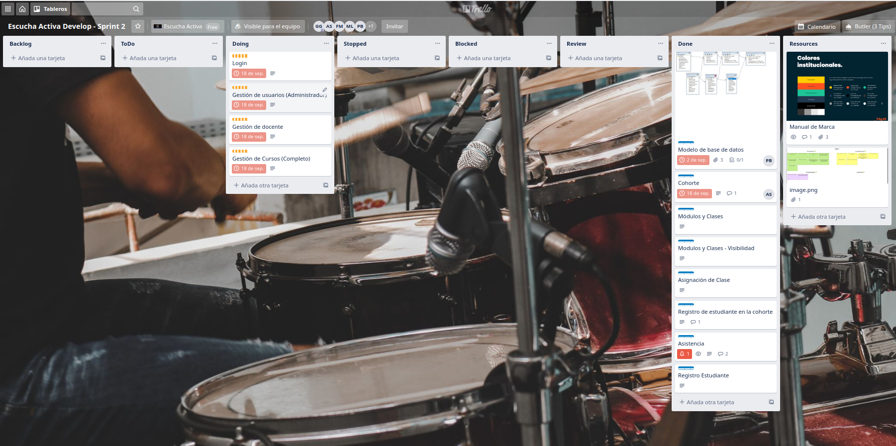
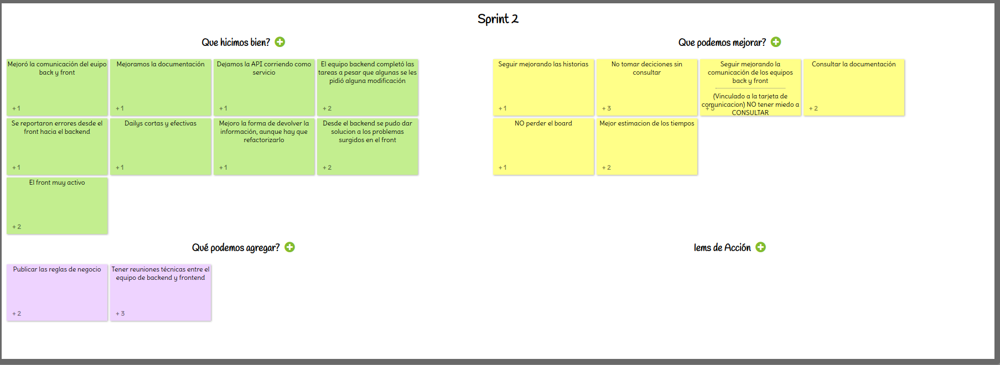

# Sprint 2

## Tablero

## Historias de Usuario Backend

::: tip DONE
- Modelo de base de datos

- Como usuario administrador y como docente debo poder crear y modificar una cohorte y poder habilitar un curso

- Como docente quiero administrar módulos y clases que pertenecen a una cohorte

- Como docente quiero habilitar módulos y clases creadas, para que los alumnos que compraron la cohorte correspondiente con los módulos y clases arriba mencionados puedan visualizarlos y consumirlos

- Como administrador y docente  quiero asignar quién dara una clase determinada de la cohorte para que el docente sepa que esa clase esta a su cargo

- Como estudiante quiero contratar un curso (cohorte) para consumir el producto

- Como estudiante quiero reportarme en una clase para que el docente sepa que asistí

- Como estudiante quiero registrarme a la plataforma para poder consultar los cursos disponibles
:::
## Historias de Usuario Frontend
::: warning DOING
- ***Como administrador del sistema debo poder loguearme con un usuario y contraseña para acceder a la gestión de la plataforma.***

    Criterios de aceptación: en caso de error en las credenciales, mostrar un cartel de "Usuario incorrecto" o "Contraseña incorrecta" según corresponda.
    Adjunto (en RESOURCE) Manual de marca para guiarse con los colores

- ***Como administrador del sistema debo poder crear y modificar usuarios de rol administradores y docentes (para la gestión de la plataforma).***
**Crear usuario**

    atributos: 
    - nombre
    - email
    - password

    Criterios de aceptación: debe haber una opción de "Gestión de usuarios", dentro de la cual podré crear y modificar usuarios. Debe haber un listado con los usuarios existentes. 
    Si el usuario ya existe, debe mostrar un cartel con un mensaje similar a "el usuario ya existe" y no debe crearlo nuevamente

- ***Como administrador del sistema debo poder crear y modificar docentes.***

    atributos:
    - nombre
    - foto
    - fecha de naciminto
    - dni
    - país
    - provincia
    - celular
    - password

    Criterios de aceptación: debe haber una opción de "Gestión de docentes", dentro de la cual podré crear y modificar los mismos. Debe haber un listado con los docentes existentes y un filtro de búsqueda. 
    Si el docente ya existe, informarlo con un mensaje y no crearlo nuevamente

- ***Como administrador del sistema y como docente debo poder Gestionar cursos.***

    Implica: 
    - crear curso nuevo
    - modificar curso existente

    **Crear nuevo curso:**

    + debo poder crear un curso.
    atributos de curso:
        - nombre
        - descripción
        - valor
        - fecha de inicio
        - cantidad Maxima de Alumnos
        - activo/inactivo
    + debo poder crear módulo. El curso debe tener al menos 1 módulo.
    atributos de módulo: 
        - nombre
        - posición
        - materail asociado
        - fecha de inicio
        - activo/inactivo
    + dentro de cada módulo debe haber al menos 1 clase. 
    atributos de la clase:
        - nombre
        - material
        - psición
        - fecha y hora de la clase
        - activo/inactivo

    **Modificar curso:**

    + debo poder modificar los atributos de un curso, sus módulos y clases

    Criterios de aceptación: debo tener una opción en el panel izquierdo donde pueda Gestionar Cursos. Dentro de la opción, en la pantalla a la derecha del panel izquierdo debo tener las opciones para gestionar el curso.
:::

## Retro & Review

